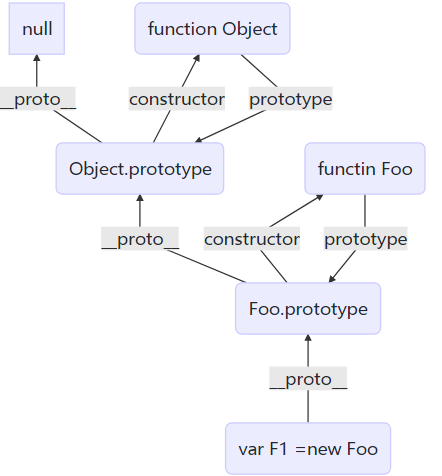

### 原型对象
> 作用定义所有实例对象共享的属性和方法

JavaScript 通过构造函数生成新对象，因此构造函数可以视为对象的模板。实例对象的属性和方法，可以定义在构造函数内部。
```javascript
function Cat (name, color) {
  this.name = name;
  this.color = color;
}

var cat1 = new Cat('小明', '白色');

cat1.name // '小明'
cat1.color // '白色'
```
构造函数缺点：
- 一个构造函数的多个实例之间，无法共享属性，从而造成对系统资源的浪费。

解决方法，就是 JavaScript 的<label style="color:#409eff; padding: 0 8px;">原型对象</label> `prototype`，因为原型对象的所有属性和方法，都能被实例对象共享。
```javascript
function Cat (name, color) {
  this.name = name;
}
Cat.prototype.color ="白色";
}
var cat1 = new Cat('巧克力');
var cat2 = new Cat('布丁');
cat1.color //白色
cat2.color//白色
```
##### JavaScript规定，每个函数都有一个`prototype`属性，指向一个对象。

- 对于构造函数来说，生成实例的时候，该属性会自动成为实例对象的原型。
- 实例对象自身就有某个属性或方法，它就不会再去原型对象寻找这个属性或方法。


```javascript
function f() {}
typeof f.prototype // "object"
```
每个 JS 对象都有 `__proto__` 属性，这个属性可以访问到  原型（`[[prototype]]`） 内部属性。这个属性在现在来说已经不推荐直接去使用它了。

### 原型链

- 实例 F1 通过`__proto__` 访问对应构造函数的原型 ->  `FOO.prototype`

- 函数原型 通过`__proto__` 访问Object的原型 ->  `Object.prototype`

- Object的原型的`__proto__`  指向 null

- 构造函数  `Object.prototype` 通过`constructor`访问构造函数本身

- 每个构造函数通过 `prototype` 访问原型

**只有函数才拥有`prototype`属性,<label style="color:#409eff; padding: 0 8px;">基本上</label>所有函数都有这个属性**

```javascript
let fun = Function.prototype.bind()
```
当声明一个函数时自动创建 `prototype` 属性，
这个属性的值是一个对象（也就是原型），且只有一个属性 `constructor`

`constructor `是一个公有且不可枚举的属性。一旦我们改变了函数的 prototype ，那么新对象就没有这个属性了（当然可以通过原型链取到 constructor）。

```javascript
function A(){}
console.log(A.prototype) // {constructor: ƒ}constructor: ƒ A()__proto__: Object
A.prototype="a"
console.log(A.prototype) //"a"
```
constructor作用：
- 让实例对象知道是什么函数构造了它
- 如果想给某些类库中的构造函数增加一些自定义的方法，就可以通过 xx.constructor.method 来扩展

###  \_\_proto\_\_
基本上每个对象都有的隐式原型属性，指向创建该对象的构造函数的原型，实际指向`[[prototype]]`， 内部属性，我们并不能访问到，所以使用 _proto_ 来访问。
```javascript
console.log({})
//__proto__: Objectconstructor: ƒ Object()hasOwnProperty: ....

```
当我们使用 new 操作符时，生成的实例对象拥有了 `__proto__`属性。
```javascript
function Foo() {}
// 这个函数是 Function 的实例对象
// function 就是一个语法糖
// 内部调用了 new Function(...)
const a =1;
const fn = new Function("console.log(a)") // Function 的this始终指向 全局对象，除非手动改变this指向
fn()//1
```
> 所有对象都可以通过原型链最终找到 Object.prototype ，虽然 Object.prototype 也是一个对象，但是这个对象却不是 Object 创造的，而是引擎自己创建了 `Object.prototype` 。可以这样说，<label style="color:#409eff; padding: 0 8px;">所有实例都是对象，但是对象不一定都是实例。</label>

-首先引擎创建了 Object.prototype ，然后创建了 Function.prototype ，并且通过__proto__ 将两者联系了起来。

- Function.prototype 以后才有了 function Function() ，然后其他的构造函数都是 function Function() 生成的。

- 函数通过 `new Function()` 生成,
<label style="color:#409eff; padding: 0 8px;" >不是所有函数都是 `new Function() `产生的。</label>


>  1. Object 是所有对象的爸爸，所有对象都可以通过__proto__ 找到它
>  2. Function 是所有函数的爸爸，所有函数都可以通过__proto__ 找到它
>  3. Function.prototype 和 Object.prototype 是两个特殊的对象，他们由引擎来创建
>  4. 除了以上两个特殊对象，其他对象都是通过构造器 new 出来的
>  5. 函数的 prototype 是一个对象，也就是原型
对象的__proto__ 指向原型，__proto__将对象和原型连接起来组成了原型链


